# TP 3 : Relations Salle, Réservation, Utilisateur, Équipement

## Description
Projet Maven utilisant Hibernate (JPA) avec une base de données H2 en mémoire.
Il modélise un système de réservation de salles avec quatre entités liées.
Le projet teste les relations OneToMany, ManyToOne et ManyToMany,
les opérations en cascade et la suppression orpheline (`orphanRemoval`).

## Technologies
- Java 8+
- Maven
- Hibernate 5.6.5.Final
- Hibernate Validator 6.2.0.Final
- H2 Database 2.1.214
- JUnit 4.13.2

## Structure du projet
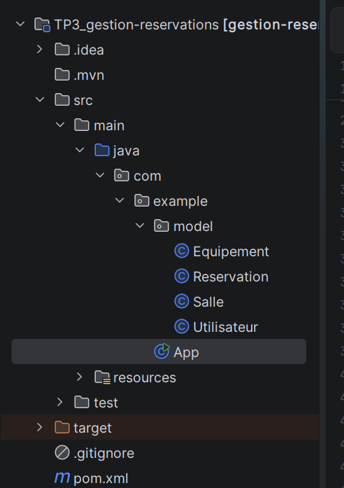

- `Utilisateur`, `Salle`, `Reservation`, `Equipement` : entités JPA (package `model`)
- `App.java` : tests des relations, de la cascade et de la suppression orpheline
- `persistence.xml` : configuration d'Hibernate et de H2 (`hbm2ddl.auto = create-drop`)

## Modèle de données

| Relation | Entités | Description |
|---|---|---|
| OneToMany / ManyToOne | Utilisateur / Reservation | Un utilisateur a plusieurs réservations |
| OneToMany / ManyToOne | Salle / Reservation | Une salle a plusieurs réservations |
| ManyToMany | Salle / Equipement | Table de jointure `salle_equipement` |

`Reservation` porte les deux clés étrangères (`utilisateur_id` et `salle_id`).
`Salle` est le côté propriétaire de la relation ManyToMany et `Equipement` le côté inverse (`mappedBy`).

### Tables générées par Hibernate
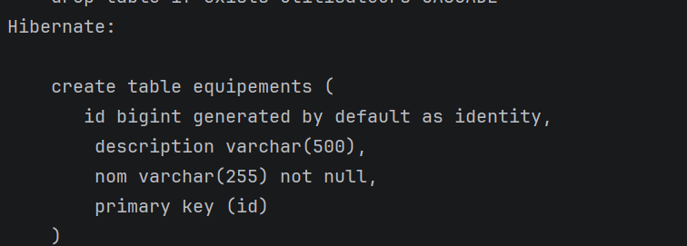
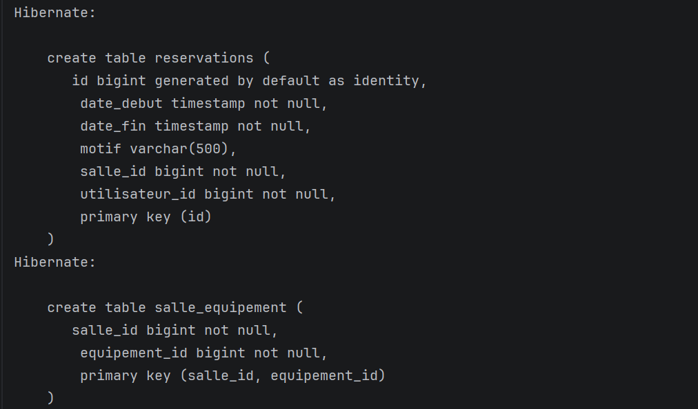

### Clés étrangères
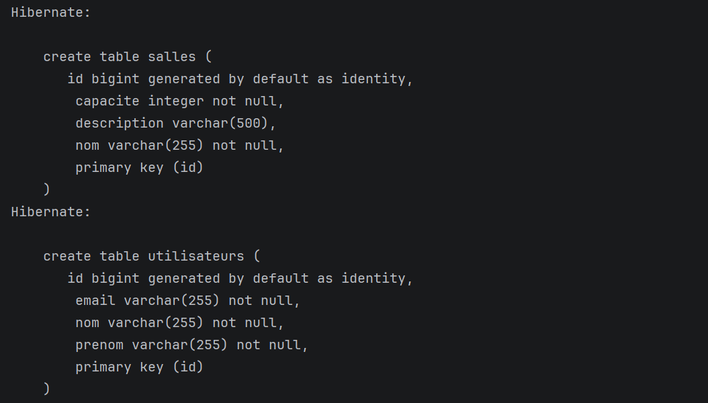

## Concepts testés

### 1. Cascade
`@OneToMany(mappedBy = "utilisateur", cascade = CascadeType.ALL)` :
les opérations sur l'utilisateur sont propagées à ses réservations.
Persister l'utilisateur et la salle suffit à enregistrer la réservation.
Après `em.clear()`, l'utilisateur et la salle ont chacun 1 réservation.

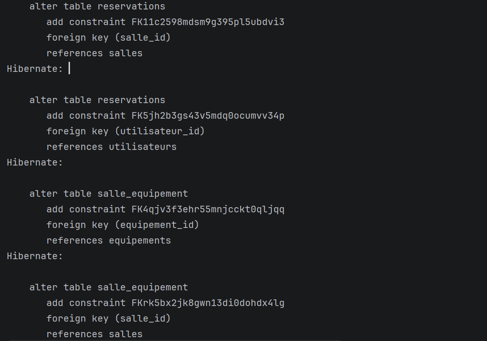
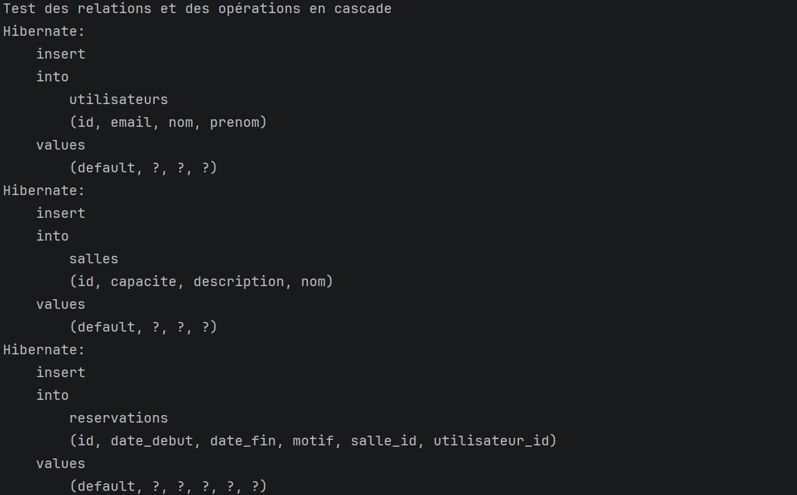
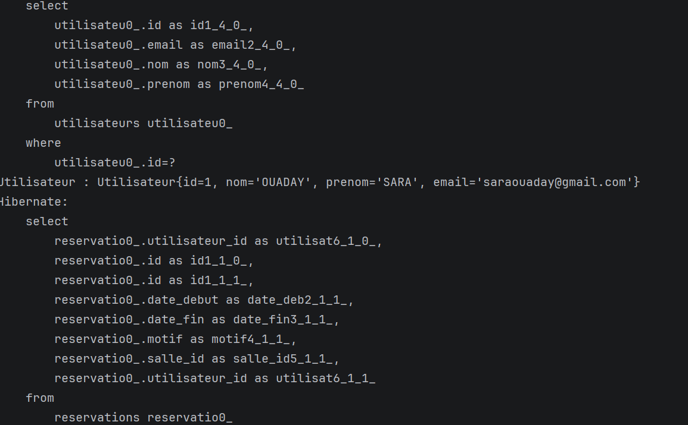

### 2. Suppression orpheline (orphanRemoval)
Avec `orphanRemoval = true`, une réservation retirée de la liste de son
utilisateur est supprimée de la base. L'utilisateur passe de 2 à 1 réservation
et Hibernate exécute un `delete from reservations`.

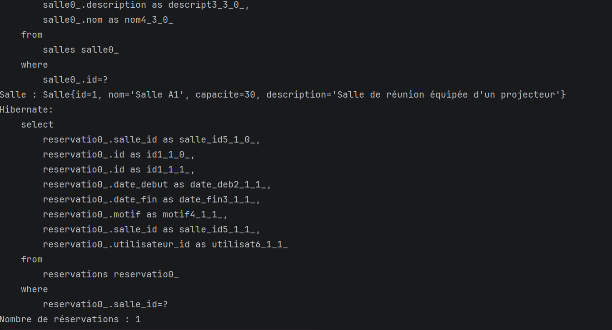


### 3. Relation ManyToMany
Le projecteur est associé à deux salles. Retirer un équipement d'une salle
supprime seulement la ligne dans `salle_equipement` : l'équipement existe
toujours dans la table `equipements`.

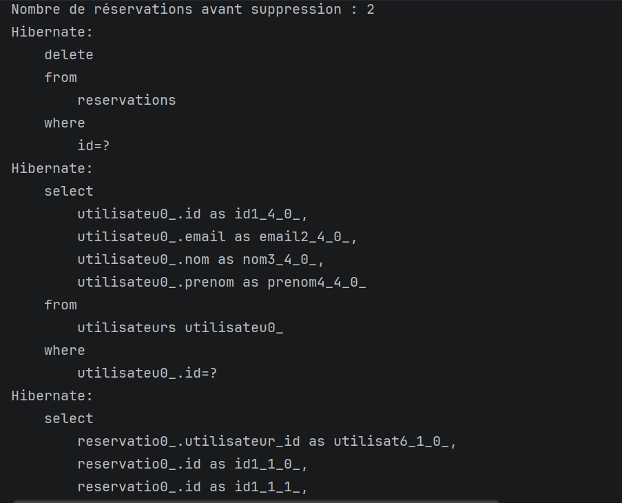
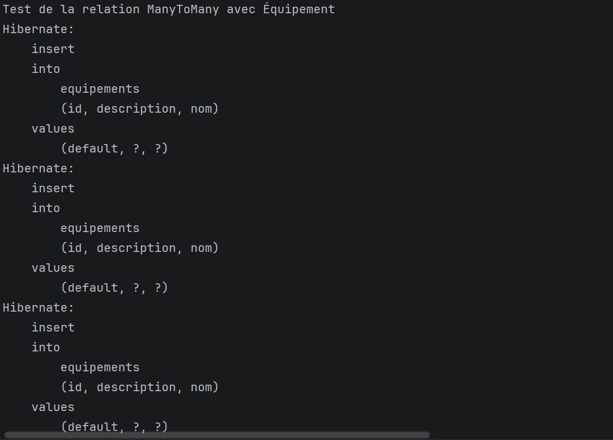
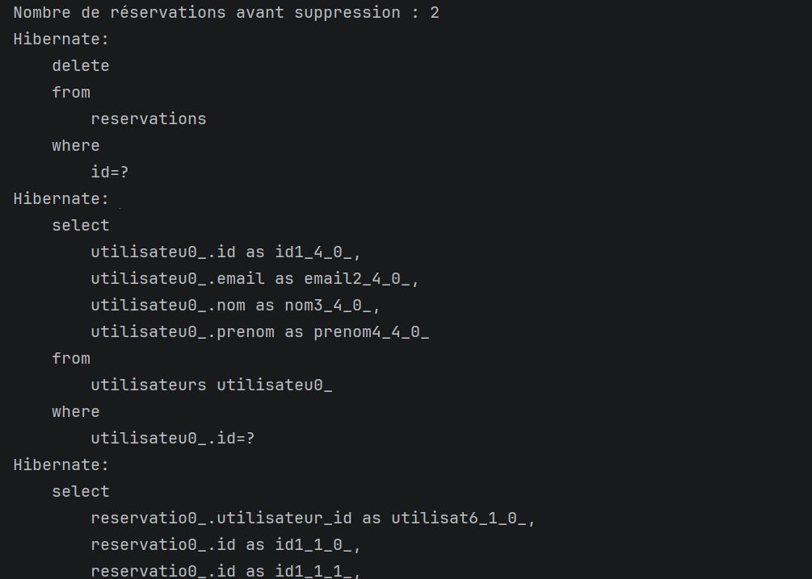

### 4. Méthodes utilitaires
`addReservation`, `removeReservation`, `addEquipement` et `removeEquipement`
mettent à jour les deux côtés des relations bidirectionnelles pour garder
des données cohérentes.

## Exécution
Lancer la classe `App.java` depuis l'IDE, ou en ligne de commande :

```bash
mvn clean compile exec:java -Dexec.mainClass="com.example.App"
```

## Auteur
Sara Ouaday
